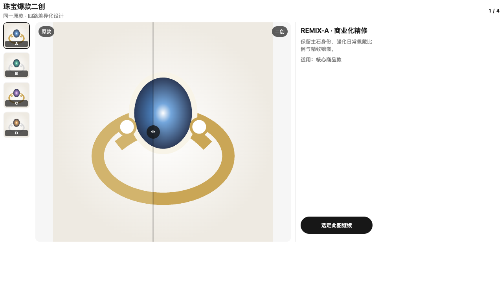

# JewelryDesignCodex

<p align="center">
  
</p>

<p align="center">
  <a href="LICENSE"></a>
  
  
  
</p>

**让 Codex 成为珠宝设计师的对话式工作台。**

JewelryDesignCodex 是一个适用于 Codex Desktop 的开源珠宝设计插件。它将专业珠宝 Skills、gpt-image-2 生成链路和 Apps UI 组合在一起，设计师可以在对话中填写简洁表单、局部标注、比较修前修后并浏览多路方案。



<p align="center"><sub>公开合成素材演示：原款对比、四路缩略图、滑屏分割和稳定方案 ID。</sub></p>

> 首个公开版本面向 **macOS 和原生 Windows 上的 Codex Desktop**。ChatGPT 网页版、Codex Cloud 与远程沙箱不能安装本地 stdio MCP 插件。

## 一句话安装

在本地 Codex Desktop 中开启新任务，发送：

```text
/goal Read https://raw.githubusercontent.com/yuyou-dev/JewelryDesignCodex/main/INSTALL.md to install and verify JewelryDesignCodex, then create and open a new jewelry design task for me.
```

中文提示词：

```text
/goal 请阅读 https://raw.githubusercontent.com/yuyou-dev/JewelryDesignCodex/main/INSTALL.md，安装并验证 JewelryDesignCodex，完成后为我创建并打开一个全新的珠宝设计任务。
```

Codex 会先检查环境和权限，再安装 `jewelry-design-codex` marketplace 与 `svt-jewelry-design` 插件，运行 doctor，最后请你重启 Codex。详细步骤见 [INSTALL.md](INSTALL.md)。

## 能做什么

| 工作流 | 对话与 Apps UI |
| --- | --- |
| 珠宝设计 | 动态问卷收集品类、材质、母题、风格和交付方向 |
| 爆款二创 | 黄金/镶嵌专用 brief，生成 4 或 8 路差异化方案 |
| 随手画转珠宝 | 空画板、草图与主石辅助起点，固定交付四款 |
| 局部修改 | 锚点、区域涂抹与逐标注修改意见 |
| 精修对比 | 单图或多图缩略图切换，滑屏对比修前修后 |
| 商业视觉 | 海报、画册、陈列、模特佩戴与多方案 Gallery |

所有生成仍由用户自己的 Codex 登录和 gpt-image-2 权限执行。仓库不包含 API Key、Codex 登录文件、飞书凭据或第三方积分。

## 快速试用

重启 Codex 后，在新任务中尝试：

```text
我想设计一款蓝宝石戒指，请先用可视化表单帮我补全设计方向。
```

```text
基于这张原款图做 4 路爆款二创。
```

```text
打开空画板，我要随手画一款项链，然后生成四款珠宝效果图。
```

## 版本与平台

| 能力 | macOS | Windows | Linux | Web/Cloud |
| --- | :---: | :---: | :---: | :---: |
| 安装与 doctor | 支持 | 支持 | 未验收 | 不支持 |
| Apps UI 与本地 MCP | 支持 | 支持 | 未验收 | 不支持 |
| gpt-image-2 生成 | 支持 | 支持 | 未验收 | 不支持 |

当前稳定版：`v0.1.1`。升级、卸载和状态修复见 [INSTALL.md](INSTALL.md#maintenance)与 [Troubleshooting](docs/TROUBLESHOOTING.md)。

## 默认插件与可选扩展

- `svt-jewelry-design`：默认安装，包含珠宝 Skills、Image-2 runner、Apps UI 和 `svt_jewelry_ui` MCP。
- `svt-jewelry-video`：可选，需要用户主动安装并完成相应视频 Provider 的鉴权。
- `svt-jewelry-feishu`：可选，需要用户主动安装并完成飞书鉴权。

可选扩展不影响核心插件的 doctor readiness。

## 项目指南

- [架构与数据边界](docs/ARCHITECTURE.md)
- [安装与故障排查](docs/TROUBLESHOOTING.md)
- [支持范围](docs/SUPPORT.md)
- [贡献指南](CONTRIBUTING.md)
- [安全政策](SECURITY.md)
- [版本变更](CHANGELOG.md)

## License 与品牌

代码使用 [Apache License 2.0](LICENSE)。“苏哇科技”、项目图标及其品牌识别不由 Apache-2.0 自动授权，详见 [TRADEMARKS.md](TRADEMARKS.md)。
