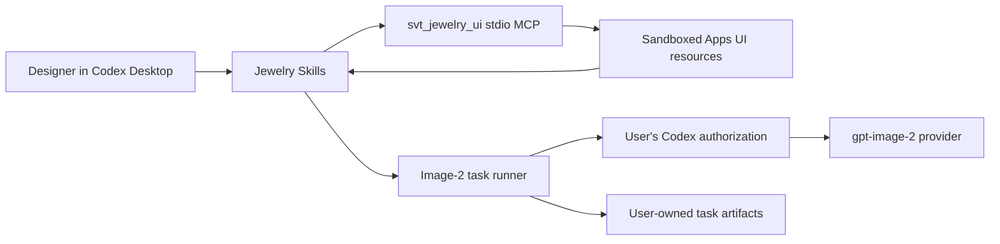

# Architecture

JewelryDesignCodex is a local Codex Desktop plugin distribution. The public Git repository is a Codex marketplace; the core plugin combines Skills, a stdio MCP server, Apps UI resources, and a task-scoped gpt-image-2 runner.

## Components

### Marketplace

`.agents/plugins/marketplace.json` exposes versioned plugins under the marketplace name `jewelry-design-codex`. Codex clones and caches the marketplace through its own plugin commands. Installation does not copy credentials or manually edit Codex configuration.

Each public install is pinned to a release tag. [UPDATE.md](../UPDATE.md) clones the next exact tag,
records the installed core and optional plugin set, replaces the fixed-ref marketplace, restores that
set, and verifies the target version. If replacement fails, the updater attempts to restore the
previous tag and reports the rollback outcome. Marketplace operations never target user workspaces.

### Core plugin

`svt-jewelry-design` is the default install:

- Skills route natural-language jewelry work to focused domain workflows.
- The local MCP registers structured forms, visual editors, comparisons, and Galleries.
- HTML Apps UI resources run in the host sandbox and exchange stable structured values with the conversation.
- Python preparation and generation scripts build task-scoped prompts and jobs, then use the user's Codex route for real generation.

The MCP is stdio and local. There is no project-hosted MCP endpoint, user database, account service, or telemetry collector.

### Optional plugins

Video and Feishu are separate plugins because they require additional CLIs, accounts, network services, and authentication. Their absence does not change core readiness. They must not reuse or export Codex credentials.

## UI data flow

1. A Skill determines whether the current brief is complete.
2. When required, it calls the registered MCP tool instead of reproducing the form in prose.
3. The tool returns structured content and identifies a versioned `ui://` resource.
4. The Apps UI sends stable IDs and a readable summary back through the host message bridge.
5. The Skill compiles the confirmed brief into task-local prompts and jobs.
6. Result UIs receive paths and metadata in structured content; compressed previews travel once in tool-result metadata.
7. A successful Gallery replaces duplicate inline images. If UI delivery fails, the conversation uses the tool's text/media fallback and names missing outputs accurately.

Apps UI never treats a permanent loading state as success. Each surface must settle into loaded, empty, or explicit error state.

## Task and media boundary

The plugin writes design work only to the active user-selected workspace. Prompts, reference copies, generated media, reports, and provider state remain in that workspace. Installation, doctor, and UI rendering do not scan unrelated user directories.

Only files explicitly attached to the active task are eligible for provider upload. The runner does not copy Codex auth files or read environment secrets for diagnostic output.

## Trust boundaries

| Boundary | Project behavior |
| --- | --- |
| GitHub to local machine | Codex CLI manages the marketplace snapshot and plugin cache. |
| Conversation to Apps UI | Versioned resource contract; stable IDs; text fallback. |
| Plugin to image provider | User's Codex login and approval path; task-selected content only. |
| Core to optional providers | Separate installation and authentication; separately reported health. |
| Repository to user assets | No user task media, credentials, or absolute personal paths are shipped. |

## Portability

The supported core path uses Node.js 20+ and Python 3.10+ without a runtime package install. Launchers resolve the plugin root and executables without POSIX-only shell assumptions. Paths are passed as argument vectors and must support spaces, Windows separators, and UTF-8 names.

See [INSTALL.md](../INSTALL.md) for first installation, [UPDATE.md](../UPDATE.md) for version migration, and [SECURITY.md](../SECURITY.md) for reporting.
